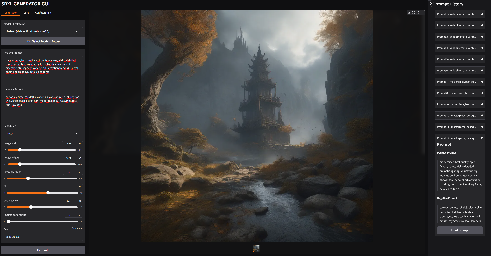

#  SDXL Image Generator

A highly optimized, work in progress **SDXL image generation tool** powered by a flexible backend pipeline and a **Gradio-based GUI**.

This project originally started as a terminal-based experiment to build custom SDXL pipelines for running various checkpoints and configurations. However, after discovering the Gradio, it evolved into an interactive graphical interface.

---

## ✨ Key Features

* **Gradio GUI:** A fully functional, user friendly graphical interface for generating images.
* **SDXL `txt2img` Pipeline:** Fully operational text to image generation using Stable Diffusion XL models.
* **Modular Pipeline Architecture:** Recently refactored to support flexibility. The architecture is designed to eventually support other generative models and dedicated upscalers without rewriting the core logic.

### 🧠 Advanced Memory Management (Dual-Tier Caching)
The feature I am most proud of is the custom **GPU/CPU Model Caching Algorithm**. 

When working with heavy AI models, you often want to test different checkpoints or temporarily switch to an upscaler before returning to your original model. Reloading massive `.safetensors` files from disk every time kills workflow momentum. 

To solve this, this library implements an active cache:
* **Smart Eviction:** The `PipelineManager` actively manages how many models sit on your GPU (VRAM) and CPU (System RAM) based on configurable integer limits. 
* **Seamless Swapping:** If the GPU is full, older models aren't destroyed-they are smoothly evicted to system RAM. When you need them again, they swap back into VRAM instantly, drastically reducing load times.
* **Future Feature:** The manager will soon automatically detect your system's total VRAM and RAM to dynamically optimize these cache limits for your specific hardware.

---

## 🚧 Project Status & Roadmap

This project is actively under construction. While the core `txt2img` pipeline and GUI are functional, several major features are currently in the works.

- [x] **Gradio GUI** (Restored and fully functional)
- [x] **SDXL Text-to-Image (`txt2img`)**
- [x] **Dual-Tier VRAM/RAM Model Caching**
- [ ] **Bash script for easy setup**
- [ ] **SDXL Image-to-Image (`img2img`)** *(Under construction)*
- [ ] **Upscaler Pipelines** *(Under construction)*
- [ ] **Multi-Architecture Support** (Integration of models like Flux)
- [ ] **Auto-Hardware Detection** (Dynamic cache limits based on system specs)

---

## I am not taht experienced developer plewse be nice :)